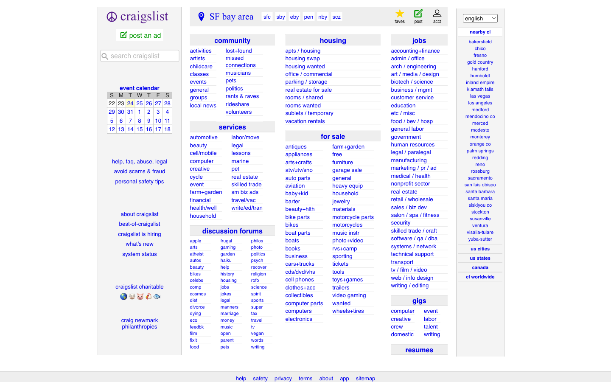
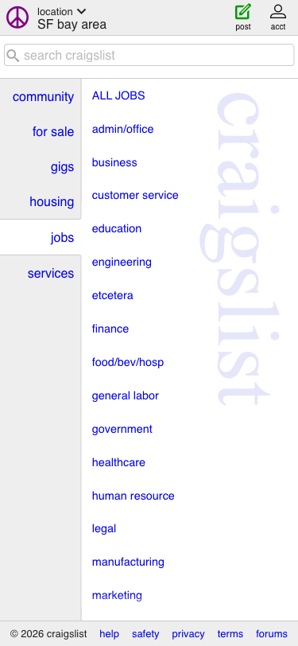

## Website Analysis: craigslist.org

**Score: 4/10** -- Lightning fast and distraction-free, but the dated interface and painful mobile experience are pushing users to modern alternatives every day.

### What's Costing You Customers

**1. Your site looks abandoned.** Craigslist's homepage has not meaningfully changed its design since the early 2000s. No images, no color, no visual cues -- just walls of purple text links on a plain white background. First-time visitors (especially younger users) instinctively associate this aesthetic with spam, phishing, or a site that is no longer maintained. People who would use your platform leave before they ever post a listing because the site does not look trustworthy enough to enter personal information or spend money on a paid posting.

**2. New visitors have no idea where to start.** The homepage presents over 450 links at once across dense columns with no visual priority. Community, housing, services, for sale, jobs, discussion forums, gigs, resumes -- all given equal visual weight. A person looking to rent an apartment sees the same small purple text as someone looking for a used bicycle or a philosophy debate forum. There is no guidance, no "start here," no prominent search experience. Every second a visitor spends scanning and deciphering your link wall is a second closer to them opening Facebook Marketplace or Zillow instead.

**3. On a phone, the experience is painful.** 275 of the clickable elements on your page are too small to tap comfortably on a phone screen. The category links are tiny text packed tightly together -- tapping "apartments" without accidentally hitting "parking / storage" right next to it is a genuine challenge. The sub-region buttons at the top ("sfc", "sby", "eby", "pen", "nby", "scz") are cryptic abbreviations that mean nothing to someone who just moved to the area. More than half of all web traffic comes from phones, and your site actively punishes those users.

### What We'd Fix (in priority order)

1. **Increase tap target sizes for mobile.** Every clickable link and button should be large enough to tap comfortably on a phone screen. Right now, the dense link lists are a usability hazard on any device without a mouse. This alone would reduce frustration for the majority of your visitors. -- _Small effort_

2. **Make search the centerpiece.** The search box is a small, unstyled input tucked into the sidebar. For a site built on finding things, search should be large, central, and inviting -- like the Google homepage. This single change could dramatically increase engagement from first-time visitors who currently feel overwhelmed by the wall of links. -- _Small effort_

3. **Give the top 3 categories real prominence.** Housing, jobs, and for-sale are what bring people to Craigslist. Make these visually dominant with larger text, icons, or distinct sections instead of drowning them in the same sea of purple links. The long tail of subcategories can live one click deeper. -- _Medium effort_

4. **Spell out the sub-regions.** Replace "sfc", "sby", "eby" with "San Francisco", "South Bay", "East Bay." New residents and tourists should not need a decoder ring to navigate your site. -- _Quick win_

5. **Add a minimal visual layer.** Simple category icons, slightly larger touch targets, and basic spacing improvements would signal "this site is actively maintained" without sacrificing the utilitarian identity that long-time users value. -- _Medium effort_

### What Caught Our Eye

- **Page speed is exceptional.** Craigslist loads in under 2.4 seconds with DOM content ready in 815 milliseconds. No bloated JavaScript frameworks, no third-party trackers, no cookie banners, no autoplay videos. In an era of 5-second load times and consent popups, this is a genuine competitive advantage that most modern websites would envy.

- **Zero distractions from the content.** There are no ads on the homepage, no pop-ups, no newsletter signup modals, no chatbots. Users come to find or post listings, and the homepage does not put anything between them and that goal. This restraint is rare and valuable.

- **The information architecture is comprehensive.** Every conceivable category is represented and logically grouped -- community, housing, services, for-sale, jobs, gigs, resumes. The taxonomy is thorough and well-organized for users who already know what they are looking for. The structured data markup for site search is a smart touch that helps Google understand how to index your content.

- **The event calendar is a thoughtful touch.** A simple, functional calendar sits in the sidebar for browsing local events by date. It is modest, unobtrusive, and genuinely useful -- exactly the kind of feature that rewards regular visitors.

### Technical Details (internal -- do NOT send to client)

**Page Metadata**
- Title: "craigslist: SF bay area jobs, apartments, for sale, services, community, and events" -- well-structured with geographic and categorical keywords
- Meta description: "craigslist provides local classifieds and forums for jobs, housing, for sale, services, local community, and events"
- OG title: present, matches page title
- OG description: present, matches meta description
- OG image: MISSING -- social shares will have no preview image
- HTML lang attribute: NOT SET -- hurts accessibility and internationalization
- Canonical URL: not specified
- Hreflang tags: absent despite 12+ language options in footer
- Schema.org: WebSite type with SearchAction -- functional but minimal

**Typography & Design**
- Body font: "Open Sans", Helvetica, Arial, sans-serif
- H1 font: "Times New Roman", Times, serif (brand identity choice)
- Body background: rgb(255, 255, 255) white
- Body text color: rgb(34, 34, 34) near-black
- Link color: #00E bright blue (potential contrast issues on gray backgrounds)
- No images on homepage (0 total)
- No custom hover states beyond browser defaults
- "post an ad" CTA is a small green text link with no visual prominence despite being a primary revenue driver

**Accessibility**
- 275 of 469 clickable elements (59%) are below the 44x44px minimum touch target size (WCAG 2.5.5)
- No HTML lang attribute set on document root (WCAG 3.1.1 violation)
- Search input lacks associated label element or aria-label (WCAG 1.3.1 / 4.1.2)
- Sub-region buttons ("sfc", "sby", "eby", "pen", "nby", "scz") have no aria-label or title attribute
- Category sections use flat heading hierarchy with minimal semantic HTML landmarks
- Calendar table lacks caption and uses minimal semantic markup
- Color contrast concerns: #00E blue on #ccc gray backgrounds likely fails WCAG AA

**Responsive Design**
- Viewport meta tag: present and properly configured (width=device-width, initial-scale=1)
- No horizontal overflow detected on mobile (375px width) -- good
- Mobile layout collapses to single-column job listing view which is functional but loses the homepage category overview
- Dense link columns with ~18-20px line heights create extremely difficult tap targets on touch devices

**Performance**
- DOM Content Loaded: 815ms
- Full page load: 2,376ms
- Total links on page: 453
- Minimal external resources -- no heavy JS frameworks, no third-party analytics/advertising
- Inline CSS in style tags rather than external cacheable stylesheets
- No images to optimize on homepage
- No lazy loading needed (text-only page)
