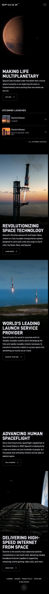
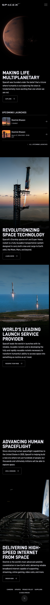

## Website Analysis: spacex.com

**Score: 6/10** — World-class visual storytelling, but no contact path, hidden navigation, and missing accessibility basics mean business visitors can't take the next step.

### What's Costing You Customers

**Business visitors have no way to reach you.** There is no contact form, no email address, no phone number, and no "Request a Quote" button anywhere on the homepage. A satellite operator who wants to book a launch or a government agency exploring partnerships has exactly one obscure path: a tiny "Suppliers" link buried in the footer. Every visitor who can't figure out how to contact you within 10 seconds is a lost opportunity -- and they're going to your competitors instead.

**Your site is invisible to people who can't see it.** All 4 background images on the homepage have no descriptions for screen readers. That means visually impaired visitors -- including engineers, procurement officers, and government officials -- get a completely blank experience. Beyond the ethical issue, this creates legal liability under ADA compliance standards and means Google can't understand what your images show, hurting your search visibility.

**Your navigation is hidden from everyone.** The entire site menu is collapsed behind a hamburger icon, even on wide desktop screens with plenty of room. Visitors who want to learn about your vehicles, missions, or launch services have to discover that small icon exists first. Research shows hamburger menus reduce feature discoverability by up to 50%. Someone visiting to evaluate SpaceX for a commercial launch contract shouldn't have to hunt for the menu.

### What We'd Fix (in priority order)

1. **Add a clear "Book a Launch" or "Contact Us" button** visible on the homepage -- not buried in the footer. Business customers need to know how to start a conversation within 5 seconds of landing on the page. -- _Quick win_

2. **Show the navigation on desktop.** Keep the hamburger for mobile, but on wider screens, display the menu items (Vehicles, Missions, Launches, Starlink) directly in the header bar. Visitors should see what you offer without clicking to discover it. -- _Small project_

3. **Add a proper page heading (H1).** The page has no main heading -- it jumps straight to H2s. Search engines use the H1 to understand what the page is about. "SpaceX -- Making Life Multiplanetary" as an H1 would strengthen your search presence and help screen readers. -- _Quick win_

4. **Add image descriptions to every photograph.** "Starship launching from Boca Chica at sunset" takes 10 seconds to write and opens your site to millions of additional visitors while reducing legal risk. -- _Quick win_

5. **Fix the horizontal scrolling issue on mobile.** The page currently extends beyond the screen width on mobile devices, creating an awkward sideways scroll. This makes the site feel broken on phones and tablets. -- _Small project_

### What Caught Our Eye

**The photography is world-class.** Every section uses a breathtaking, real image that tells a story -- Mars at golden hour, Starship launching at dusk, Falcon 9 landing on a drone ship, Starlink satellites in production. These are not stock photos. They communicate ambition, scale, and craftsmanship without saying a word.

**The one-message-per-screen layout is bold and effective.** Each full-viewport section delivers exactly one idea with one call to action. There is no clutter, no competing elements, no visual noise. This takes confidence to pull off, and SpaceX does it well. The "Upcoming Launches" section with a live countdown timer is a particularly engaging touch that gives visitors a reason to return.

**The brand voice is distinctive and consistent.** Headlines like "Making life multiplanetary" and "World's leading launch service provider" are clear, ambitious, and jargon-free. The copy is concise -- each section is one paragraph. It respects the visitor's time while conveying massive ambition.

**The footer is clean and purposeful.** Careers, Updates, Privacy Policy, Suppliers -- nothing unnecessary. The X (Twitter) link makes sense given SpaceX's active social presence. This restraint is rare and appreciated.

### Technical Details (internal -- do NOT send to client)

**Page Metadata**
- Title: "SpaceX" -- minimal, could include mission-relevant keywords
- Meta description: "SpaceX designs, manufactures and launches advanced rockets and spacecraft. The company was founded in 2002 to revolutionize space technology, with the ultimate goal of enabling people to live on other planets." -- present and well-written
- OG title: "SpaceX" -- present
- OG description: "SpaceX designs, manufactures and launches advanced rockets and spacecraft." -- present but truncated vs meta description
- OG image: https://www.spacex.com/assets/images/share.jpg -- present
- HTML lang: "en" -- set correctly
- Canonical URL: MISSING -- could cause duplicate content issues
- Schema.org/JSON-LD: MISSING -- no structured data detected
- Twitter card: MISSING -- social shares on X won't render optimally
- Robots meta: not set (defaults to index/follow)

**Typography & Design**
- Body font: D-DIN, Arial, Verdana, sans-serif (custom font)
- Full-bleed cinematic sections with text overlay on dark photography
- Dark theme throughout (black backgrounds, white/light uppercase typography)
- Consistent CTA pattern: uppercase text + right-arrow icon
- All section headings are H2 level -- no H1 present on the page
- 5 full-viewport hero sections: Mars, Starship, Falcon 9, Dragon, Starlink

**Content Structure**
- H2 headings: "Making life multiplanetary", "Revolutionizing space technology", "World's leading launch service provider", "Advancing human spaceflight", "Delivering high-speed internet from space"
- CTAs: EXPLORE, LEARN MORE, RESERVE YOUR RIDE, JOIN A MISSION, ORDER NOW
- Upcoming Launches section with live countdown timer and next 2 launches listed
- Footer links: Careers, Updates, Privacy Policy, Suppliers, X (Twitter)
- No forms, no interactive elements beyond navigation and CTAs

**Accessibility (Critical)**
- No H1 heading -- page starts at H2 level (WCAG 1.3.1 violation)
- 4 of 4 images have no alt text (WCAG 1.1.1 violation) -- all are decorative background images but serve as section context
- No skip-navigation link for keyboard users (WCAG 2.4.1 violation)
- No `<main>` landmark -- screen readers cannot jump to primary content
- Logo home link has no accessible name (img with empty alt inside link)
- White text overlaid on photographs -- contrast ratio varies with image content, may fail in lighter regions (WCAG 1.4.3)
- Footer links are only 12px tall -- below 44px minimum touch target (WCAG 2.5.5)
- Hamburger menu button labeled "Open and close navigation menu" -- accessible name is good

**SEO**
- Meta description present and descriptive (good)
- No H1 tag -- first heading is H2 (bad for SEO hierarchy)
- No canonical URL defined
- No structured data / schema markup detected
- OG tags present but incomplete (no twitter:card)
- Page title "SpaceX" is minimal -- could benefit from keyword inclusion

**Performance**
- 0 console errors detected during page load (clean)
- Site uses client-side rendering -- main content loads after initial page shell
- D-DIN custom font loaded via @font-face (.woff2, .woff, .otf formats)
- Full-page consists of 5 full-viewport image sections -- large payload but appropriate for design intent

**Responsive Design**
- Viewport: `width=device-width, user-scalable=1` -- allows user zoom (good)
- Horizontal overflow detected on mobile (375px width) -- body.scrollWidth > window.innerWidth (bad)
- Navigation collapses to hamburger on all viewport sizes (even desktop)
- Footer link tap targets at 12px height -- well below 44px minimum
- Mobile layout is essentially the same as desktop -- no mobile-specific optimizations for the dense countdown timer UI

**Anti-Patterns Verdict: PASS**
- No AI slop detected. No gradient text, glassmorphism, card grids, hero metrics, or generic SaaS patterns.
- The dark cinematic aesthetic is intentional and brand-appropriate for aerospace.
- Real photography, distinctive voice, and restrained design indicate human creative direction.
