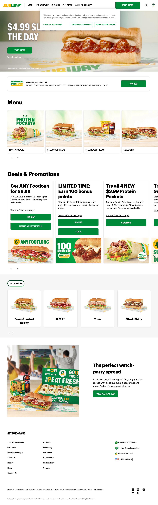
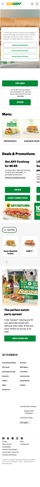

## Website Analysis: subway.com

**Score: 5.5/10** — Strong brand identity and appetizing food photography, but broken assets, missing SEO fundamentals, and a cookie banner that blocks the hero on mobile are silently costing Subway customers every day.

---

### What's Costing You Customers

- **Your homepage is blocked on mobile.** The cookie consent banner covers almost the entire screen on phones, hiding your hero video and "$4.99 Sub of the Day" offer. Visitors who don't immediately know how to dismiss it will leave before seeing a single sandwich — and mobile is where most fast-food orders start.

- **Google can't properly preview your site in search results.** There are no Open Graph tags (og:title, og:description, og:image) and no structured data (Schema.org). When someone shares your homepage on social media or in a group chat, it shows a bare link instead of an appetizing sandwich image with your deal. That's free advertising you're leaving on the table.

- **26 of your 59 images are invisible to search engines.** Nearly half your product photos — the Protein Pockets, the Sub of the Day, the catering spread — have no alt text. Google Image Search is a major discovery channel for food businesses, and you're missing it entirely.

---

### What We'd Fix (in priority order)

1. **Make the cookie banner non-blocking on mobile** so visitors immediately see your hero offer and "Start Order" button instead of a wall of legal text. _[Low effort]_

2. **Add Open Graph and Schema.org markup** so that when customers share your deals on iMessage, WhatsApp, or Facebook, a mouth-watering image and your current promotion appear automatically — turning every share into a mini-ad. _[Low effort]_

3. **Fix the 5+ broken image assets** (close icons, pickup icons, share icons) that are returning server errors (HTTP 500). These broken resources slow down every single page load and trigger JavaScript errors. _[Medium effort]_

4. **Add descriptive alt text to all 26 product images** so Google can index your Protein Pockets, B.M.T., and catering photos — driving hungry searchers straight to your order page. _[Medium effort]_

5. **Improve mobile touch targets** — 69 of 143 interactive elements (buttons, links) are smaller than the recommended 44x44px minimum. On a phone screen, tapping "Terms & Conditions" or "Sign In" is a frustrating game of precision that slows down ordering. _[Medium effort]_

---

### What Caught Our Eye

- **The video hero banner is a smart move.** A looping background video of fresh subs being assembled immediately communicates freshness and quality — far more engaging than a static image. The "$4.99 Sub of the Day" overlay is clear and action-oriented.

- **The Deals & Promotions carousel is well-structured.** Each card has a clear headline, concise copy, specific pricing, and a direct CTA ("Join Now," "Order Now"). The progression from $3.99 Protein Pockets to $4.99 Sub of the Day to $6.99 Meal of the Day gives every budget a reason to order.

- **The Sub Club loyalty integration is seamless.** The rewards program is woven throughout the homepage without feeling forced — from the sticky banner to the deal cards requiring membership. It creates urgency ("LIMITED TIME: Earn 100 bonus points") while making joining feel like an obvious win.

- **The "Top Picks" section with real product photography** (Oven-Roasted Turkey, B.M.T., Tuna, Steak Philly) gives first-time visitors an instant on-ramp. Rather than overwhelming them with the full menu, it curates the best sellers.

---

### Technical Details (internal — do NOT send to client)

**Page Metadata:**
- Title: "Home | Subway®"
- Meta description: "Discover better-for-you sub sandwiches at Subway. View our menu of sandwiches, order online, find restaurants, order catering or buy gift cards."
- OG tags: NOT FOUND (og:title, og:description, og:image all missing)
- Schema.org/JSON-LD: NOT FOUND
- HTML lang: en-US
- Viewport: width=device-width, initial-scale=1

**Typography:**
- Body: "Subway Sans LCG Web", Georgia, "Helvetica Neue", Helvetica, Arial, sans-serif
- H1: SubwaySansLCGBold, "Helvetica Neue", Helvetica, Arial, sans-serif
- Custom web fonts loaded: SubwaySansLCGBold (woff), SubwaySansCondMedium (woff)

**Content Structure:**
- H1 content: "Unable to load the page" (hidden error fallback element — actual visible H1 is missing, content rendered via JS components)
- No proper H1 visible to crawlers; headings start at H2 ("$4.99 Sub of the Day") and H3 ("Menu", "Deals & Promotions")
- Missing heading hierarchy (no H1 → jumps to H2/H3/H4)

**Images:**
- Total images: 59
- Images without alt text: 26 (44%)
- Key missing: menu carousel items, promotional card images, icon assets

**Performance:**
- TTFB: 281ms (good)
- DOM Content Loaded: 736ms (good)
- Load event: 748ms (good — but heavily JS-deferred)
- Heavy JS payload: Kount fraud SDK, Branch.io, Dynatrace, Quantum Metric, LaunchDarkly, Apptentive SDK, OneTrust, Adobe Launch

**Console Errors (14 total):**
- 5x HTTP 500 errors on image assets: close.png, close@2x.png, close@3x.png, 05-ui-icon-pickup@3x.png, share.png
- Namespace collision error from Apptentive SDK
- TypeError: "Cannot read properties of undefined" from Adobe Launch
- favicon-32x32.png returns 500

**Accessibility:**
- Small touch targets: 69 of 143 interactive elements below 44x44px
- No horizontal overflow detected
- Cookie banner uses proper ARIA dialog role
- Skip navigation link present ("Skip to main content")

**Third-party Scripts (heavy load):**
- Kount Web Client SDK (fraud detection)
- Branch.io (deep linking/attribution)
- Dynatrace (performance monitoring)
- Quantum Metric (analytics)
- LaunchDarkly (feature flags)
- Apptentive SDK (customer feedback)
- OneTrust (cookie consent)
- Adobe Launch (tag management)
- Google Maps API

**Geo-redirect Behavior:**
- subway.com aggressively geo-redirects based on IP location
- Non-US visitors are redirected to localized versions (e.g., /es-mx for Mexico)
- The redirect chain can interfere with crawlers and link sharing

**SEO Issues:**
- No Open Graph tags
- No Schema.org structured data (no Restaurant, FoodEstablishment, or Organization markup)
- H1 element contains error fallback text, not visible heading
- 44% of images lack alt text
- Meta description is generic — doesn't mention current promotions or differentiation
