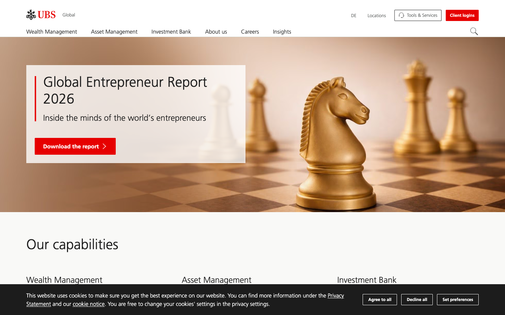
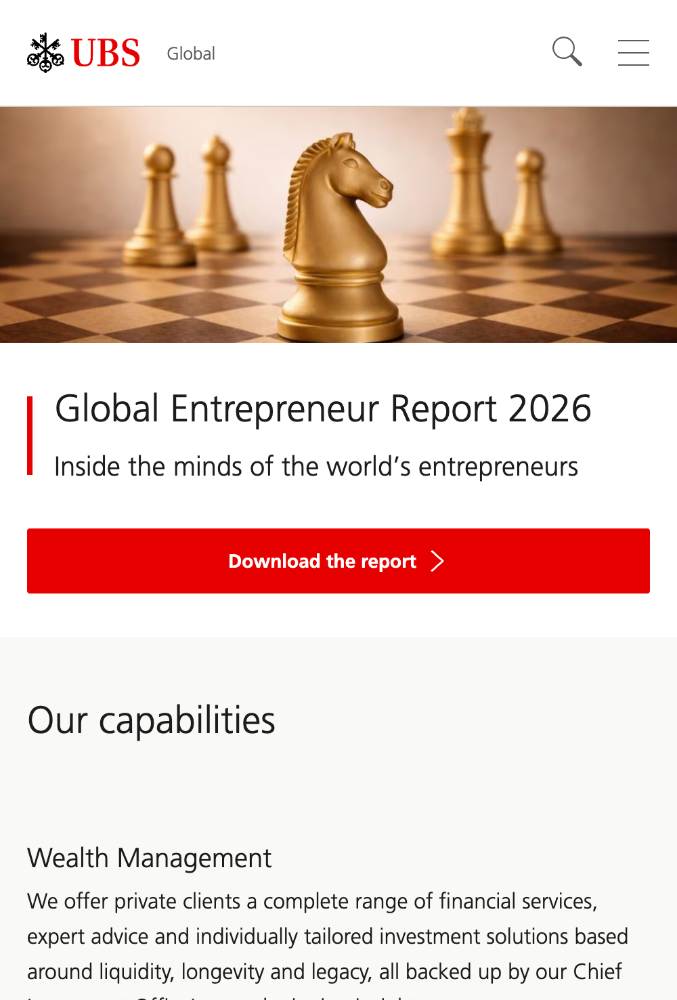

## Website Analysis: ubs.com

**Score: 6/10** — Fast, well-structured foundations and strong SEO basics, but the homepage reads like a brochure with no clear path for visitors, broken icon fonts, and half the images invisible to Google.

### What's Costing You Customers

- **Your website feels like a brochure, not a destination.** The global homepage lists six business divisions with nearly identical "Overview" links but gives visitors no clear reason to stay or take action. Someone landing here from a Google search has to figure out where they belong -- and most won't bother. They'll go to a competitor whose site guides them immediately.

- **Half your images are invisible to Google.** Four of your eight images have no descriptive text, including key visuals in the capabilities section. That means Google can't index them, and anyone using a screen reader skips right past your content. For a brand that emphasizes trust and accessibility, that's a gap your competitors can exploit.

- **Your icon fonts are broken.** The custom UBS icon font files fail to load on every single page visit, generating repeated browser warnings. Wherever you use icons for navigation, buttons, or visual cues, visitors may see blank squares or nothing at all -- making the site feel unfinished or broken.

### What We'd Fix (in priority order)

1. **Make every image work for your Google rankings** -- add descriptive alt text to the 4 images missing it, especially the hero chess image and the "About us" photo. · _Quick win_

2. **Fix the broken icon fonts** -- the WOFF and WOFF2 icon font files (UBS-Desktop-Responsive-Icons) are corrupted or misconfigured. Regenerate or replace them so icons render correctly across all browsers. · _Quick win_

3. **Move the Fraud Alert below the fold or into a banner** -- the lengthy Credit Suisse integration fraud warning dominates valuable real estate on the homepage. A persistent but compact notification bar would communicate the same urgency without pushing your actual services off-screen. · _Quick win_

4. **Guide visitors to the right place in seconds** -- replace the six equal-weight capability blocks with a clear "I am a..." selector (private client / institutional investor / corporate client). Visitors self-select, you reduce bounce rate. · _Larger project_

5. **Modernize the tech stack** -- the site still loads jQuery Migrate 3.5, a library designed to ease transitions from legacy jQuery code. Removing it would reduce page weight and signal to technical visitors that UBS keeps its digital presence current. · _Small project_

### What Caught Our Eye

- **The chess imagery is striking.** The hero image of a gold knight on a chessboard is a powerful visual metaphor for strategic financial thinking. It immediately communicates sophistication and forward planning -- exactly the feeling a wealth management firm should evoke.

- **The page loads fast.** At under 700ms to full load, the UBS homepage outperforms the vast majority of financial services websites. That kind of speed keeps visitors engaged and sends positive signals to Google.

- **Clean, confident typography.** The minimalist use of a sans-serif font with generous whitespace gives the site a premium, trustworthy feel. The visual hierarchy is clear: you know immediately what's a heading, what's body text, and what's a link.

- **Strong SEO foundations.** Open Graph tags, meta descriptions, Schema.org markup, and a proper viewport tag are all in place. The site is built on a solid technical base that many competitors overlook entirely.

### Technical Details (internal -- do NOT send to client)

**Lighthouse Scores (snapshot mode):**

| Category | Desktop | Mobile |
|----------|---------|--------|
| Accessibility | 100 | 100 |
| Best Practices | 100 | 100 |
| SEO | 83 | 100 |

**Page Metadata:**
- Title: "UBS financial services around the globe | UBS Global"
- Meta description: "UBS is a global firm providing financial services in over 50 markets."
- OG title, OG description, OG image: all present (image uses relative URL -- should be absolute)
- Schema.org: 2 JSON-LD blocks present
- HTML lang: en

**Content Structure:**
- H1: "UBS Global" (too generic, not descriptive)
- Total images: 8 (4 without alt text, 50%)
- Total links: 184
- Small touch targets (<44px): 44 elements

**Performance:**
- DOM Content Loaded: 79ms
- Full page load: 664ms
- No horizontal overflow detected
- 0 JavaScript errors

**Console Issues:**
- Multiple font decode warnings: UBS-Desktop-Responsive-Icons.woff2 and .woff both fail with OTS parsing errors
- Feature-Policy header deprecation warning (should use Permissions-Policy)
- jQuery Migrate 3.5 loaded (legacy dependency)

**Infrastructure:**
- Built on Adobe Experience Manager (AEM)
- jQuery + jQuery Migrate still in use
- Navigation has skip links (good)
- Keyboard shortcuts defined (Ctrl+Alt+1 for content, Ctrl+Alt+2 for nav)
- Geo-redirects: ubs.com redirects to localized version based on IP
- Cookie banner present, non-blocking (overlays at bottom)
- Fraud alert section related to Credit Suisse integration takes significant page real estate
