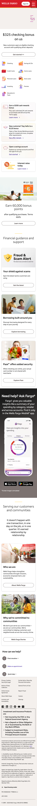

## Website Analysis: wellsfargo.com

**Score: 6/10** — A trusted brand with solid performance and strong promotional copy, but poor SEO fundamentals and accessibility gaps are undermining discoverability and leaving entire customer segments behind.

### What's Costing You Customers

- **Google is only seeing half your story.** 14 of 17 images on your homepage have no description -- including your promotional banners for the $325 checking bonus, the home mortgage hero, and the Fargo app showcase. Search engines cannot read those images, which means people searching for "checking account bonus" or "home loans" are less likely to find you. Your SEO score is 60 out of 100, well below where a Fortune 50 brand should sit.

- **Your main heading says nothing about what you offer.** The primary headline on your homepage is just "Wells Fargo" -- it tells Google and visitors nothing about banking, mortgages, credit cards, or any of your services. A visitor landing from search sees a login form and a brand name, not a reason to stay. Your competitors lead with benefit-driven headlines that tell customers exactly what they will get.

- **People using screen readers or keyboards are hitting walls.** Several buttons have no labels, links have no descriptive text, and your page structure is missing key landmarks that assistive technology relies on. This affects the roughly 1 in 5 Americans with a disability, and it creates legal exposure under ADA compliance requirements. An accessibility score of 83 means real people are struggling to use your site.

### What We'd Fix (in priority order)

1. **Make every image tell Google what it shows** -- add descriptive text to the checking bonus banner, mortgage hero, Fargo app screenshots, and all promotional cards. This directly improves search rankings for product-specific queries. · _Quick win_

2. **Rewrite the main headline to sell, not just label** -- replace the generic "Wells Fargo" H1 with something that communicates value, like "Banking, Loans & Investing -- Built Around You." This helps both search visibility and first-impression conversion. · _Quick win_

3. **Fix unlabeled buttons and links** -- the social media icons in the footer and several interactive elements have no text for screen readers or search engines. Adding proper labels is a small code change with outsized accessibility and SEO impact. · _Quick win_

4. **Add proper page structure landmarks** -- the main content area needs to be properly marked so screen readers can navigate directly to it. Without this, keyboard users must tab through the entire header and login form to reach any content. · _Quick win_

5. **Improve link text for SEO and usability** -- at least one link uses generic text like "Learn more" instead of describing where it leads. Descriptive link text helps both visitors and Google understand your page structure. · _Quick win_

### What Caught Our Eye

- **The sign-on experience is front and center.** Putting the login form directly on the homepage with a warm "Good evening" greeting is smart -- it tells existing customers "this is your space" immediately. The passkey sign-on option shows Wells Fargo is investing in modern, passwordless authentication ahead of most competitors.

- **The promotional offers are compelling and specific.** "$325 checking bonus," "$125 bonus for students," "0% intro APR for 21 months" -- these are concrete, dollar-value offers that give visitors an immediate reason to act. The tiered approach (premium checking, student banking, credit cards) covers multiple customer segments without feeling cluttered.

- **The "Ask Fargo" AI assistant section is well-positioned.** Promoting the AI-powered assistant with a clear value proposition ("summary of your spending by category, retailer and across accounts") differentiates Wells Fargo from competitors still relying on basic mobile banking. The app download CTAs are placed right where interest peaks.

- **Community commitment feels authentic.** The "Serving our customers and communities" section with links to Wells Fargo Stories is not a generic corporate responsibility checkbox -- the copy ("It doesn't happen with one transaction, in one day on the job, or in one quarter. It's earned relationship by relationship.") reads as genuine and self-aware.

### Technical Details (internal)

**Lighthouse Scores (snapshot mode, desktop):**

| Category | Score |
|----------|-------|
| Accessibility | 83/100 |
| Best Practices | 100/100 |
| SEO | 60/100 |

**Audit Metrics (automated scan):**

| Check | Result | Severity |
|-------|--------|----------|
| Page title | "Wells Fargo Bank \| Financial Services & Online Banking" | Good |
| Meta description | Present (153 chars) | Good |
| Open Graph tags | og:title, og:description, og:image all present | Good |
| Schema.org markup | 1 structured data block found | Good |
| H1 content | "Wells Fargo" (too generic, not descriptive) | Medium |
| Images without alt text | 14/17 (82%) | Critical (WCAG 1.1.1) |
| Buttons without accessible name | Multiple found | Critical |
| Links without discernible name | Multiple found (social icons, footer links) | High |
| Links with non-descriptive text | 1 found | Medium |
| Main landmark | Missing from page structure | High (WCAG) |
| Touch targets < 44px | 46/244 (19%) | Medium |
| Horizontal overflow | None detected | Good |
| HTML lang attribute | "en" | Good |
| Font stack | "Wells Fargo Sans Regular", Arial, Helvetica | Good (custom brand font) |
| DOM Content Loaded | 579ms | Good |
| Full page load | 1,519ms | Acceptable |
| Console errors | 8 (all Content-Security-Policy directive warnings) | Low |
| No functional JS errors | Confirmed | Good |

**Anti-Patterns Verdict: PASS.** This is clearly a professionally designed enterprise site, not AI-generated. No gradient text, no glassmorphism, no glowing dark-mode accents. The design is corporate and conservative, which is appropriate for a financial institution. Custom brand font (Wells Fargo Sans) with proper fallback chain.

**Console Error Detail:**
All 8 console errors are Content-Security-Policy directive warnings about the `default-src` containing `'none'` alongside other source expressions. These are configuration warnings in the CSP header, not functional errors. They appear in the OneTrust banner SDK, login preferences script, and bot detection script. No user-facing functionality is broken.

**Critique Notes:**

- The homepage is heavily weighted toward the sign-on experience. Visitors who are not existing customers must scroll past the login form to find any product information. This is a reasonable trade-off for a bank (most homepage visits are returning customers signing in), but it means new customer acquisition relies entirely on the promotional banners below the fold.
- The "Interest rates today" section uses a dropdown button ("Check rates") that does not expand without interaction -- visitors may not realize current rates are available without clicking.
- Social media links in the footer all point to "#" (anchor links) rather than actual social profile URLs. This suggests they are JavaScript-driven, but the empty href values mean search engines cannot follow them and they provide no SEO value.
- The page uses zero-width joiner characters (&#x200d;) as spacers in some headings, which screen readers may announce oddly.
- Multiple external redirects in CTAs (accountoffers.wellsfargo.com, creditcards.wellsfargo.com, connect.secure.wellsfargo.com) add latency to conversion paths.
- The $325 checking bonus -- arguably the strongest acquisition hook -- sits below the fold, competing with the sign-on panel for attention.
- The "Paze" digital checkout feature is promoted alongside financial guidance content -- the positioning feels slightly off-category (payments tech next to life planning), but it does introduce a differentiator.
- The footer contains extensive legal disclaimers (FDIC, investment product warnings, SIPC, trademark attributions) which is standard for financial services but adds significant page length.
- Load performance is solid at 1.5 seconds, with DOM interactive at 579ms -- fast for a page loading an embedded login form from a secure subdomain (connect.secure.wellsfargo.com).
- Spanish language support ("Espanol" link in header navigation) demonstrates inclusivity and expands the addressable market.
- Skip-to-content link is present, which is good practice.
- Heading hierarchy (h1 > h2 > h3) is properly structured throughout the page.
